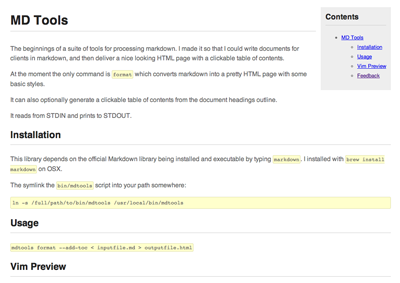

MD Tools
========

The beginnings of a suite of tools for processing markdown. I made it so that I
could write documents for clients in markdown, and then deliver a nice looking
HTML page with a clickable table of contents.

At the moment the only command is `format` which converts markdown into a
pretty HTML page with some basic styles.

It can also optionally generate a clickable table of contents from the document
headings outline.

It reads from STDIN and prints to STDOUT.

Installation
------------

This library depends on the official Markdown library being installed and
executable by typing `markdown`. I installed with `brew install markdown` on OSX.

Then symlink the `bin/mdtools` script into your path somewhere:

	ln -s /full/path/to/bin/mdtools /usr/local/bin/mdtools

Usage
-----

`mdtools format --add-toc < inputfile.md > outputfile.html`

Vim Preview
-----------

You can use this snippet in your .vimrc file to make a shortcut for previewing
markdown in your browser:

	nnoremap <leader>md :w ! mdtools format --add-toc > /tmp/mdpreview.html && open /tmp/mdpreview.html<cr><cr>

Then the `<leader>md` key command will open up the preview in your default
browser.

Sample
------

Here's a sample of the output:

Feedback
--------

Greatly appreciated: jamiermill at gmail.

